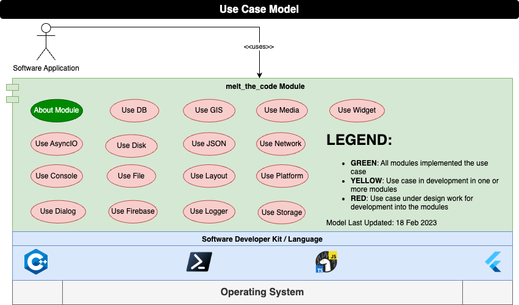

<center><a href="/"></a></center>

<h1> Cross Platform Modules - Design </h1>

**Table of Contents**

- [Introduction](#introduction)
- [Full Stack Engineering](#full-stack-engineering)
- [Functional Decomposition](#functional-decomposition)
  - [About Module](#about-module)
  - [Use AsyncIO](#use-asyncio)
  - [Use Disk](#use-disk)
  - [Use Math](#use-math)
- [Design Notes](#design-notes)
- [License](#license)

## Introduction

"Write once, run anywhere (WORA)" was the famous slogan made by Sun Microsystems in 1995.  At the time, this technology allowed for easy full stack engineering allowing you to target dedicated workstations and on premise servers. So long as a Java Runtime Environment existed, you could run your code.

Java was unable to keep to their slogan as web browsers became more advanced, mobile devices became ubiquitous, and companies no longer required dedicated servers.  Software engineers are now required to learn multiple languages, technologies, and frameworks in order to fully support full stack engineering.

This project aims to simplify **Full Stack Engineering** by developing a set of cross platform modules implementing a similar / identical Application Program Interface (API) regardless of the chosen technology covered by this project.  This allows a developer to maximize their productivity because regardless of the technology, they are learning a similar module API for their solution.

## Full Stack Engineering

Stack | Description
--- | ---
Web | This provides the greatest access to people. If a platform has a web browser, then you have the ability to present information to them. Flutter provides the ability to target the web with a rich set of plugins and widgets. Deno provides you access to both Server / Cloud infrastructure along with wrapping the Web APIs in the browser.  Both these technologies offer the ability to build Progressive Web Applications.
Mobile | Most people these days access information via a cell phone or tablet. They are prevalent in all aspects of life. A developer could utilize native programming languages to target Android or iOS mobile devices but this takes time. Utilizing Flutter you can easily target the Mobile and Desktop environments.
Server / Cloud | Servers, custom built on premise or the cloud host providers, represents your backend data and services.  Flutter, Deno, and pwsh all offer the ability to `script` and or compile backend services.
Desktop | People still access desktop applications.  Each of these technologies can easily target the desktop based on a user's needs.  pwsh can provide a powerful Command Line Interface (CLI).  Deno and Flutter can provide CLI or rich desktop Graphical User Interfaces (GUI).
Raspberry Pi | Raspberry Pi is a low level single board computer that can be utilized for all sorts of use cases.  Each of these technologies have the ability to run on this platform but be advised, performance can vary.

## Functional Decomposition



The **Use Case Model** depicted above shows `melt_the_code Module` use cases to be implemented.  The identified use cases reflect common domains for solving typical software engineering tasks.  Each use case will implement a set of functions common to those domains providing a consistent and similar API regardless of the chosen SDK.  Any short comings of the SDK to provide functionality will be handled via a `C/C++ FFI Bridge`.

The sub-sections below are a use case breakdown for each of the identified use case domains.

### About Module

You just want to know what it is you are using.

```
TITLE:     melt_the_code [Technology] Module
VERSION:   v0.0.0 (Released on dd mmm yyyy)
WEBSITE:   https://dev.codemeled.com/[module]
LICENSE:   MIT / © yyyy Mark Shaffer. All Rights Reserved.

Where VERSION is defined as:
v0.0.0
 ^ Full implementation of the Module versioned design
   ^ Full implementation of a Use Case
     ^ Partial implementation of a Use Case / bug fix
```

### Use AsyncIO

`Description:` Sometimes need to divide up your work to allow for other work.  This use case provides you the ability to one shot a task either in the main thread or in the background, kickoff a dedicated task, or simply sleep an asynchronous task.

`Pre-condition:` An identified task that requires asynchronous processing as follows:
 - Dedicated background task
 - One shot asynchronous task to process in the background or on the main thread
 - The ability to sleep an asynchronous function.

`Post-condition:` Task is processed asynchronously returning the processed value.

`Scenario:`

1. If spawning a dedicated task, you will specify the dedicated task URL and `TaskRunnerHandler` to receive processed data.
   - Upon successful construction, you will get a `TaskRunner` object.
   - You will send data to the `TaskRunner` object to process in a dedicated background thread
   - You will terminate the `TaskRunner` once no longer required
2. If spawning a one shot task, you specify the task, the data to pass to the task, and any delay to schedule the task in the future.  Upon completion of the task, you receive the data processed if data is to be returned.
3. If sleeping an asynchronous task, you specify in milliseconds to delay a task.  Upon completion, the asynchronous task is delayed by that specified time.
4. END

`Exceptions:` `CodeMeltedError` if a background task cannot be spawned or if an error is encountered during the processing of the specified task.

### Use Disk

`Description:` You want to perform house keeping of files and directories on your disk. This use case provides you the common methods to manage a disk and query information about files and directories on that disk.

`Pre-condition:` A user needs to manipulate files / directories on disk as follows:
- Copying a file or directory to another location
- Getting file information from a directory listing
- Making a directory to store files / directories
- Moving files / directory to another location on disk
- Removing a file / directory from disk
- The ability to open and manipulate files

`Post-condition:` Identified disk manipulation is carried out.

`Scenario:`

1. If copying a file or directory, you specify the `src` and `dest` of where to copy the contents.  Contents are copied to that location
2. If getting a listing of file information, you specify the `path` of the information you want to retrieve.  Receive an array of `FileInfo` objects identifying what is contained in that directory.
3. If needed to make a directory on disk, you specify the `path` of the directory to create.  Directory is then created on disk.
4. If moving files, you specify the `src` and `dest` of where you want to move the contents.  Contents are moved to that location or renamed if you are simply changing the name on disk.
5. If removing a file or directory, you specify the `src` of the item to remove.  Item is removed from the disk.
6. If wanting to manipulate a file on disk, you will have one of several options:
   - Open an read all contents of a file as binary or text
   - Write all contents to a file as binary or text
   - Ability to open a file broker to work with the file as you see fit until closing when completed
7. END

`Exceptions:` `CodeMeltedError` if attempting to access this use case in a Runtime Environment that does not have this feature or if the use case scenario cannot be completed.

### Use Math

`Description:` Math is hard.  Remembering formulas is even harder.  This use case provides you with a collection of all sorts of common formulas from unit conversions, geometric, algebraic, geodetic, physics, and much more.

`Pre-condition:` Series of doubles identifying the parameters of the equation to solve.

`Post-condition:` Results of the formula as a singular or array of doubles if the formula results in more then one answer.

`Scenario:`

1. If necessary, you want to convert between temperature units as identified below
    - celsiusToFahrenheit
    - celsiusToKelvin
    - fahrenheitToCelsius
    - fahrenheitToKelvin
    - kelvinToCelsius
    - kelvinToFahrenheit
2. END

`Exceptions:` None.

## Design Notes

TBD

## License

MIT License

Copyright (c) 2022 Mark Shaffer

Permission is hereby granted, free of charge, to any person obtaining a copy
of this software and associated documentation files (the "Software"), to deal
in the Software without restriction, including without limitation the rights
to use, copy, modify, merge, publish, distribute, sublicense, and/or sell
copies of the Software, and to permit persons to whom the Software is
furnished to do so, subject to the following conditions:

The above copyright notice and this permission notice shall be included in all
copies or substantial portions of the Software.

THE SOFTWARE IS PROVIDED "AS IS", WITHOUT WARRANTY OF ANY KIND, EXPRESS OR
IMPLIED, INCLUDING BUT NOT LIMITED TO THE WARRANTIES OF MERCHANTABILITY,
FITNESS FOR A PARTICULAR PURPOSE AND NONINFRINGEMENT. IN NO EVENT SHALL THE
AUTHORS OR COPYRIGHT HOLDERS BE LIABLE FOR ANY CLAIM, DAMAGES OR OTHER
LIABILITY, WHETHER IN AN ACTION OF CONTRACT, TORT OR OTHERWISE, ARISING FROM,
OUT OF OR IN CONNECTION WITH THE SOFTWARE OR THE USE OR OTHER DEALINGS IN THE SOFTWARE.