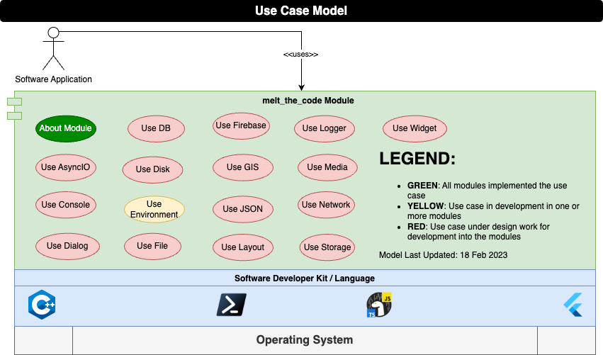

<h1> Cross Platform Modules </h1>

**Table of Contents**

- [1.0 Introduction](#10-introduction)
  - [1.1 Purpose](#11-purpose)
  - [1.2 Scope](#12-scope)
- [2.0 Functional Decomposition](#20-functional-decomposition)
  - [2.1 About Module](#21-about-module)
  - [2.2 Use Environment](#22-use-environment)
- [3.0 Design Notes](#30-design-notes)
- [4.0 License](#40-license)

# 1.0 Introduction

## 1.1 Purpose

"Write once, run anywhere (WORA)" was the famous slogan made by Sun Microsystems in 1995.  At the time, this technology allowed for easy full stack engineering allowing you to target dedicated workstations and on premise servers. So long as a Java Runtime Environment existed, you could run your code.

Java was unable to keep to their slogan as web browsers became more advanced, mobile devices became ubiquitous, and companies no longer required dedicated servers.  Software engineers are now required to learn multiple languages, technologies, and frameworks in order to fully support full stack engineering.

This project aims to simplify by developing a set of cross platform modules implementing a similar / identical Application Program Interface (API) regardless of the chosen technology covered by this project.  This allows a developer to maximize their productivity because regardless of the technology, they are learning a similar module API for their solution.

## 1.2 Scope

The scope of this project is to deliver a set of cross platform modules that allow a developer to tackle the following tech stacks.

Stack | Description
--- | ---
Web | This provides the greatest access to people. If a platform has a web browser, then you have the ability to present information to them. Flutter provides the ability to target the web with a rich set of plugins and widgets. Deno provides you access to both Server / Cloud infrastructure along with wrapping the Web APIs in the browser.  Both these technologies offer the ability to build Progressive Web Applications.
Mobile | Most people these days access information via a cell phone or tablet. They are prevalent in all aspects of life. A developer could utilize native programming languages to target Android or iOS mobile devices but this takes time. Utilizing Flutter you can easily target the Mobile and Desktop environments.
Server / Cloud | Servers, custom built on premise or the cloud host providers, represents your backend data and services.  Flutter, Deno, and pwsh all offer the ability to `script` and or compile backend services.
Desktop | People still access desktop applications.  Each of these technologies can easily target the desktop based on a user's needs.  pwsh can provide a powerful Command Line Interface (CLI).  Deno and Flutter can provide CLI or rich desktop Graphical User Interfaces (GUI).
Raspberry Pi | Raspberry Pi is a low level single board computer that can be utilized for all sorts of use cases.  Each of these technologies have the ability to run on this platform but be advised, performance can vary.

# 2.0 Functional Decomposition



The **Use Case Model** depicted above shows `melt_the_code Module` use cases to be implemented.  The identified use cases reflect common domains for solving typical software engineering tasks.  Each use case will implement a set of functions common to those domains providing a consistent and similar API regardless of the chosen SDK.

The sub-sections below are a use case breakdown for each of the identified use case domains.

## 2.1 About Module

**`WHO:`** As a software developer

**`WHAT:`** I want to be able to identify the version of the melt_the_code module

**`WHY:`** So that I have a capability to version control the module to my deployed software.

**`ACCEPTANCE CRITERIA:`**

You just want to know what it is you are using.

```
TITLE:    melt_the_code [Technology] Module
VERSION:  v0.0.0 (Released on dd mmm yyyy)
WEBSITE:  https://codemeled.dev/modules/[sdk]/melt_the_code
LICENSE:  MIT / © yyyy Mark Shaffer. All Rights Reserved.

Where VERSION is defined as:
v0.0.0
^ Full implementation of the Module versioned design
  ^ Full implementation of a Use Case
    ^ Partial implementation of a Use Case / bug fix
```

## 2.2 Use Environment

**`WHO:`** As a software developer

**`WHAT:`** I want to be able to interact with the runtime environment

**`WHY:`** So that I have the ability to gather necessary information from that environment and utilize desktop services.

**`ACCEPTANCE CRITERIA:`**

1. When you have the ability to manage environment variables as follows:
   1. Get an environment variable as string or null if not found
   2. Set an environment variable
   3. Remove an environment variable
2. When you have the ability to open links via the URL link protocol service.  These link protocols include `file://`, `http(s)://`, and `mailto://` protocols
3. When you have the ability to query aspects about the given environment.  This information includes:
   1. `eol` - The end of line character for new lines on the operating system
   2. `hostname` - The hostname of the given platform
   3. `numberOfProcessors` - How many threads could this thing spin up
   4. `osName` - The name of the operating system
   5. `osVersion` - The version number of the operating system
   6. `pathSeparator` - The file separator used on disk
4. When you have the ability to gather metrics about the given environment to include (NOTE: Only available on some SDKs):
   1. `availableMemory` - The currently available memory
   2. `usedMemory` - The currently consumed memory
   3. `totalMemory` - The total memory of available to the environment
   4. `usedCPU` - The currently utilized CPU
5. When you have the ability to use the metrics gathered and monitor the environment by collecting the stats to stdout and CSV if specified.

# 3.0 Design Notes

TBD.

# 4.0 License


MIT License

© 2023 Mark Shaffer. All Rights Reserved.

Permission is hereby granted, free of charge, to any person obtaining a copy
of this software and associated documentation files (the "Software"), to deal
in the Software without restriction, including without limitation the rights
to use, copy, modify, merge, publish, distribute, sublicense, and/or sell
copies of the Software, and to permit persons to whom the Software is
furnished to do so, subject to the following conditions:

The above copyright notice and this permission notice shall be included in all
copies or substantial portions of the Software.

THE SOFTWARE IS PROVIDED "AS IS", WITHOUT WARRANTY OF ANY KIND, EXPRESS OR
IMPLIED, INCLUDING BUT NOT LIMITED TO THE WARRANTIES OF MERCHANTABILITY,
FITNESS FOR A PARTICULAR PURPOSE AND NONINFRINGEMENT. IN NO EVENT SHALL THE
AUTHORS OR COPYRIGHT HOLDERS BE LIABLE FOR ANY CLAIM, DAMAGES OR OTHER
LIABILITY, WHETHER IN AN ACTION OF CONTRACT, TORT OR OTHERWISE, ARISING FROM,
OUT OF OR IN CONNECTION WITH THE SOFTWARE OR THE USE OR OTHER DEALINGS IN THE SOFTWARE.
