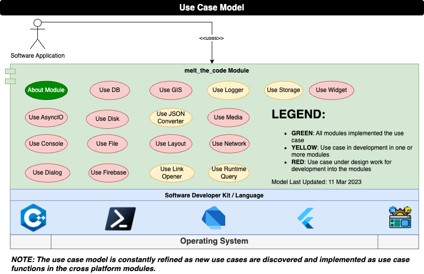

<h1> Cross Platform Modules </h1>

**Table of Contents**

- [1.0 Introduction](#10-introduction)
  - [1.1 Purpose](#11-purpose)
  - [1.2 Scope](#12-scope)
- [2.0 Module Architecture](#20-module-architecture)
  - [2.1 Technology Stack](#21-technology-stack)
  - [2.2 Functional Decomposition](#22-functional-decomposition)
  - [2.3 Use Case Implementation Process](#23-use-case-implementation-process)
- [3.0 Repo Setup](#30-repo-setup)
  - [3.1 Installations](#31-installations)
    - [3.1.1 Tools](#311-tools)
    - [3.1.2 Visual Studio Code](#312-visual-studio-code)
  - [3.2 Testing](#32-testing)
    - [3.2.1 Dev Site Validation](#321-dev-site-validation)
    - [3.2.2 Dev Site Deployment](#322-dev-site-deployment)
    - [3.2.3 Publishing Modules](#323-publishing-modules)
- [4.0 License](#40-license)

# 1.0 Introduction

## 1.1 Purpose

"Write once, run anywhere (WORA)" was the famous slogan made by Sun Microsystems in 1995.  At the time, this technology allowed for easy full stack engineering allowing you to target dedicated workstations and on premise servers. So long as a Java Runtime Environment existed, you could run your code.

Java was unable to keep to their slogan as web browsers became more advanced, mobile devices became ubiquitous, and companies no longer required dedicated servers.  Software engineers are now required to learn multiple languages, technologies, and frameworks in order to fully support full stack engineering.

This project aims to simplify by developing a set of cross platform modules implementing a similar / identical Application Program Interface (API) regardless of the chosen technology covered by this project.  This allows a developer to maximize their productivity because regardless of the technology, they are learning a similar module API for their solution.

## 1.2 Scope

The scope of this project is to deliver a set of cross platform modules that allow a developer to tackle the different technology stacks.  The chosen language SDKs described in the table below.

SDK | Description
--- | ---
C++ | XXX
pwsh | XXX
dart | XXX
flutter | XXX
web | XXX

# 2.0 Module Architecture

## 2.1 Technology Stack

## 2.2 Functional Decomposition

## 2.3 Use Case Implementation Process

TBD

# 3.0 Repo Setup

Path | Description
--- | ---
`.firebase` | XXX
`dist` | XXX
`melt_the_code_xxx` | XXX
`use_case_features` | xxx
`website-nav` | XXX
`./*` | XXXX

## 3.1 Installations

### 3.1.1 Tools

*NOTE: If installing on Mac OS, you may want to consider [Homebrew](https://brew.sh) to install some of the items below as they may not work as advertised on their websites.*

- [ ] [Git](https://git-scm.com/)
  - [ ] [GitHub Desktop](https://desktop.github.com/) (not required just nice to have)
- [ ] [C++](https://code.visualstudio.com/docs/languages/cpp)
  - [ ] [doxygen](https://www.doxygen.nl)
- [ ] [deno](https://deno.land/)
  - [ ] [nodejs](https://nodejs.org/en/)
  - [ ] [typescript](https://www.npmjs.com/package/typescript) (install globally)
  - [ ] [typedoc](https://typedoc.org/guides/installation/) (install globally)
- [ ] [flutter](https://flutter.dev/)
  - [ ] [dartdoc](https://pub.dev/packages/dartdoc)
- [ ] [pwsh](https://github.com/PowerShell/PowerShell#get-powershell)
  - [ ] [Pester](https://www.powershellgallery.com/packages/Pester/5.1.1)
- [ ] [Python3](https://www.python.org/)

### 3.1.2 Visual Studio Code

- [ ] [VS Code](https://code.visualstudio.com/)
- [ ] [C/C++ Extension Pack](https://marketplace.visualstudio.com/items?itemName=ms-vscode.cpptools-extension-pack)
- [ ] [Code Spell Checker](https://marketplace.visualstudio.com/items?itemName=streetsidesoftware.code-spell-checker)
- [ ] [Deno](https://marketplace.visualstudio.com/items?itemName=denoland.vscode-deno)
- [ ] [Flutter](https://marketplace.visualstudio.com/items?itemName=Dart-Code.flutter)
- [ ] [Markdown All in One](https://marketplace.visualstudio.com/items?itemName=yzhang.markdown-all-in-one)
- [ ] [PowerShell](https://marketplace.visualstudio.com/items?itemName=ms-vscode.PowerShell)

## 3.2 Testing

The following procedure represent the steps to confirm your setup of the previous section tooling worked and would also be used for any validation of changes made to this repo via the

### 3.2.1 Dev Site Validation

- [ ] Open a terminal to the repo
- [ ] Execute the command `./build.ps1 --dev-site` in the terminal window.  View the output and confirm no errors in the execution.
- [ ] Execute the command `cd dist` to bring you to the built output
- [ ] Execute the command `python3 -m http.server` to start a web server
- [ ] Open a web browser window and enter the address `http://[::]:8000/`.  You should see the DEV page rendered and all the links should work

### 3.2.2 Dev Site Deployment

TBD

### 3.2.3 Publishing Modules

TBD

# 4.0 License

MIT License

© 2023 Mark Shaffer. All Rights Reserved.

Permission is hereby granted, free of charge, to any person obtaining a copy
of this software and associated documentation files (the "Software"), to deal
in the Software without restriction, including without limitation the rights
to use, copy, modify, merge, publish, distribute, sublicense, and/or sell
copies of the Software, and to permit persons to whom the Software is
furnished to do so, subject to the following conditions:

The above copyright notice and this permission notice shall be included in all
copies or substantial portions of the Software.

THE SOFTWARE IS PROVIDED "AS IS", WITHOUT WARRANTY OF ANY KIND, EXPRESS OR
IMPLIED, INCLUDING BUT NOT LIMITED TO THE WARRANTIES OF MERCHANTABILITY,
FITNESS FOR A PARTICULAR PURPOSE AND NONINFRINGEMENT. IN NO EVENT SHALL THE
AUTHORS OR COPYRIGHT HOLDERS BE LIABLE FOR ANY CLAIM, DAMAGES OR OTHER
LIABILITY, WHETHER IN AN ACTION OF CONTRACT, TORT OR OTHERWISE, ARISING FROM,
OUT OF OR IN CONNECTION WITH THE SOFTWARE OR THE USE OR OTHER DEALINGS IN THE SOFTWARE.
